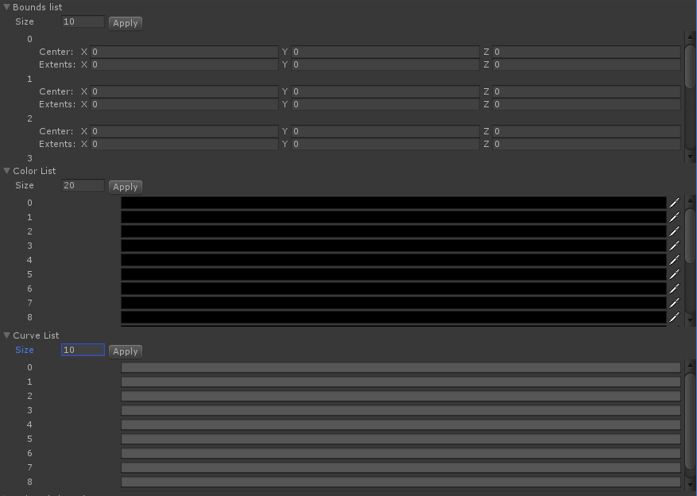

ListFields
====


## Description
UnityのEditorGUI向けにListFieldを追加するライブラリです。  
複数のFieldをリスト化して管理します。  

内部で保存しているListのCountをListCount、GUIかSetCount関数にて設定されるCountをFieldCountと表現しています。

## Usage
サンプルコード
``` csharp
private TextList textList = null;

void Init() {
    this.textList = new TextList("Text List");
}

void OnGUI() {
    this.textList.Draw();

    foreach(var str in this.textList.GetList()){
        Debug.Log(str);
    }
}
``` 
より詳しい使い方は[Example](https://github.com/a3geek/ListFields/blob/master/Assets/ListFields/Example/Editor/ListFieldExample.cs)を参照してください。 

### Listの種類
- BoundsList (BoundsField)
- ColorList (ColorField)
- CurveList (CurveField)
- DelayedFloatList (DelayedFloatField)
- DelayedIntList (DelayedIntField)
- DelayedTextList (DelayedTextField)
- DoubeList (DoubleField)
- FloatList (FloatField)
- IntList (IntField)
- LabelList (LabelField)
- LayerList (LayerField)
- MaskList (MaskField)
- ObjectList (ObjectField)
- PasswordList (PasswordField)
- PropertyList (PropertyField)
- RectList (RectField)
- TagList (TagField)
- TextList (TextField)
- Vector2List (Vector2Field)
- Vector3List (Vector3Field)
- Vector4List (Vector4Field)

### 新しい種類を追加する方法
1. `ListField<T>`を継承する (Tは保存するListの型)
2. `protected abstract Func<int, T, T> drawer { get; }`を`override`して各要素の描画方法を実装する

## Behavior
- FieldCountを設定するGUIでは、Applyボタン以外にEnterキーによっても適用されます。
- Indexerが実装されていますが、ListCountではなくFieldCountに依存しています。
- GUIかSetCount関数にてFieldCountが減らされても内部的にはListCountは変更せず値は維持されるので、FieldCountとListCountは必ずしも一致しません。
``` csharp
var textList = new TextList("Text List");
Debug.Log(textList.Count); // 0

textList.SetCount(0);
textList.AddValue("a");
textList.AddValue("b");
textList.AddValue("c");

Debug.Log(textList.Count); // 3
Debug.Log(textList[0]); // "a"
Debug.Log(textList[1]); // "b"
Debug.Log(textList[2]); // "c"

textList.SetCount(0);
Debug.Log(textList.Count); // 0

textList.SetCount(3);
Debug.Log(textList.Count); // 3
// 前に保存した値が維持されている
Debug.Log(textList[0]); // "a"
Debug.Log(textList[1]); // "b"
Debug.Log(textList[2]); // "c"
```

## API
### インターフェース
ListFieldはIListTypeを継承しており、*マークが付いているAPIはIListTypeに宣言されています。  
`<T>`は保存するListの型を表しています。

### プロパティ
#### `event Action<bool> OnFoldToggle` *
Listの表示・非表示が行われた時に呼ばれるイベント

#### `event Action OnCountChanged` *
ListCountが変更された時に呼ばれるイベント

#### `Func<int, object, object> Drawer { get; }` *
各要素の描画関数

#### `Func<int, string> Labeler { get; set; }` *
各要素のラベル表示を決める関数

#### `float MinHeight { get; set; }` *
要素を表示する領域の高さの最小値

#### `float MaxHeight { get; set; }` *
要素を表示する領域の高さの最大値

#### `float MinWidth { get; set; }` *
要素を表示する領域の幅の最小値

#### `float MaxWidth { get; set; }` *
要素を表示する領域の幅の最大値

#### `bool ShowHorizontalScrollBar { get; set; }` *
要素を表示する領域に横スクロールバーの表示・非表示を設定

#### `bool ShowVerticalScrollBar { get; set; }` *
要素を表示する領域に縦スクロールバーの表示・非表示を設定

#### `bool ShowCountField { get; set; }` *
ListCountを設定するGUIの表示・非表示を設定

#### `int Count { get; }` *
FieldCountを取得

#### `bool Folding { get; }` *
ListFieldが表示・非表示に関する状態を取得

#### `string Label { get; }` *
ListFieldのラベルを取得

### 関数

#### `void Draw()` *
ListFieldの描画(OnGUI関数等で呼び出してください)

#### `void SetCount(int count)` *
FieldCountの設定

#### `IEnumerable<object> GetObjectList()` *
object型に変換されたListを取得

#### `IEnumerable<T> GetList()`
FieldCount分のListデータを取得  

#### `IEnumerable<T> GetAllList()`
FieldCountに関係なく、内部的に保存している全てのListデータを取得

#### `IEnumerable<T> GetValidityList()`
FieldCount分のListデータからNullではないデータを抽出して取得

## Example
1. Assets/ListFields/Scenes/ListFields.unity を開きます。
2. メニューバーのA3Utility → ListFields → Example Windowを選びます。
3. [Screenshots](##Screenshots)にあるウィンドウが表示されます。

## Screenshots
